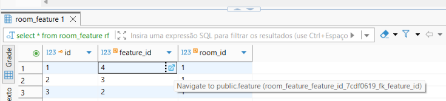
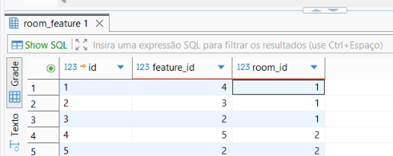

# Semana 3

Existe um bug no DBeaver particularmente irritante que sempre tive ao utilizá-lo. Quando faço a consulta em uma tabela com chave estrangeira, ao clicar no valor da variável estrangeira de uma linha específica, a busca trás os dados da tabela extrangeira relacioado ao valor clicado. Essa função é bem prática a auxilia bastante na navegação entre dados relacionados.

O problema acontece quando vou tentar fazer novamente em outra consulta, essa navegação já não aparece mais como opção. Normalmente preciso reiniciar o dbeaver para isso, o que torna inviável, já que eu teria que reiniciar o debeaver a cada nova consulta em que eu quisesse navegar por uma chave estrangeira.

Pesquisando nas issues, encontrei uma bem semelhante sobre esse bug ainda em aberto desde 14 de dezembro de 2024, #[35678](https://github.com/dbeaver/dbeaver/issues/35678).

Para reproduzir o bug, atualizei o DBeaver para a versão mais recente disponível e verifiquei se o erro ainda persistia, e sim, ele ainda ocorre. Percebi que ao rodar o SQL com Control + Enter isso não ocorre, mas ao executar com Alt + X sim. E me dei conta também que sempre executei meus SQLs com Alt + X.

Existe sim uma diferença entre rodar uma instrução SQL (Control + Enter) e um script (Alt + X), mas os links de navegação das chaves estrangeiras não deveriam desaparecer, ao meu ver é sim um bug.

Nas próximas semanas quero debugar o codigo para tentar entender esse trecho, ver se consigo corrigir e no futuro conversar com a equipe responsável pela issue para verificar a possibilidade de contribuir com a correção.