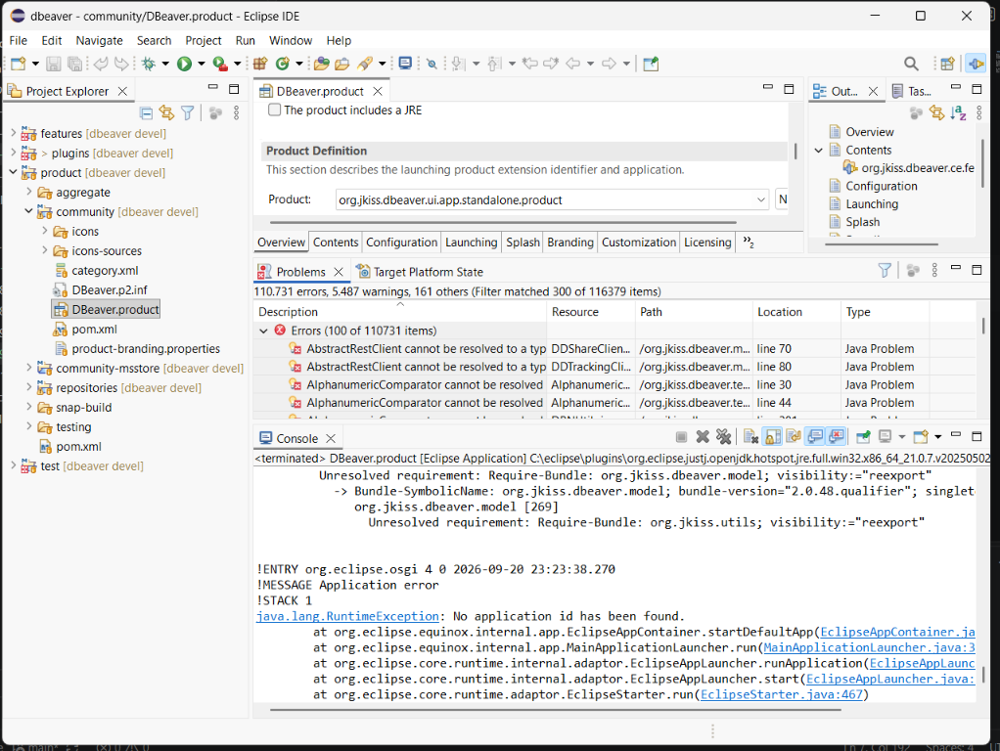

# Semana 4

Nesta semana, foquei em preparar o DBeaver para rodar localmente, seguindo a documentação do projeto. Clonei o repositório, instalei o Eclipse RCP e comecei a configurar as dependências.

Ao tentar rodar, tive bastante dificuldade nas configurações que precisam ser aplicadas na maquina. Acredito que por ser um projeto grande, o tempo de build e instalações de depêndencias foi bem demorado, aumentanado ainda mais o tempo para cada erro na tentativa de configuração.

Um dos problema que tive foi o build indicando que faltava o repositório datadam-api, que precisei clonar na mesma pasta do projeto principal. A primeiro momento também utilizei o eclipse mais atual e com a versão do Java abaixo da 25, onde disparava erros nas dependências.

No momento ainda não consegui rodar o projeto, a IDE aponta outros erros ao atualizar as dependências dos plugins e passou a mostrar diversos tipos não encontrados. Meu próximo passo é concluir o build com o JDK correto e, em seguida, debugar o projeto para entender o funcionamento do codigo.

