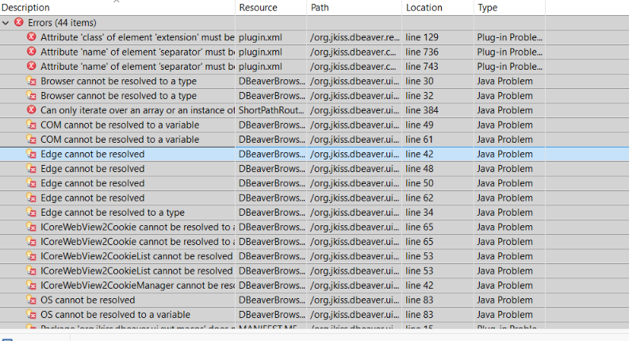
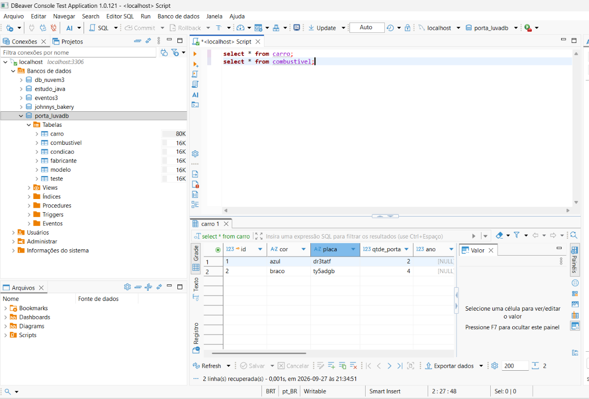
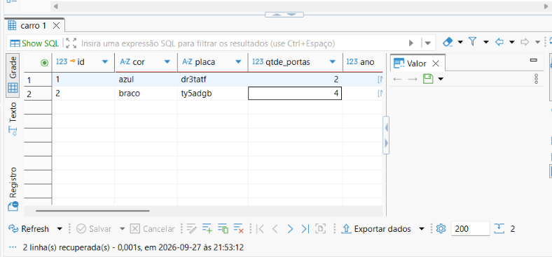

# Semana 5

Consegui rodar o projeto!!!

Apesar do meu Java Home estar com o path do Java versão 25 (sugerido pela documentação do DBeaver), o eclipse estava rodando com a versão 21. Não era o problema principal, existia um componente que dava conflito no eclipse e impedia de rodar.

O componente era o Tycho Project Configurators e tive que remove-lo manualmente e atualizar tanto o maven quanto o projeto pelo eclipse.

Depois de penar até encontrar como corrigir esses apontamentos, ainda existem alguns erros apontados por plugins. Porém, eles não impedem a execução.

Agora com o projeto rodando, consegui testar fazendo uma conexão MySQL no localhost em um banco local que tinha salvo e realizei algumas consultas.

Consegui reproduzir o erro, agora pelo projeto rodando localmente.

Na próxima semana quero realizar o debug para entender em que momento do codigo isso acontece e como posso corrigir.